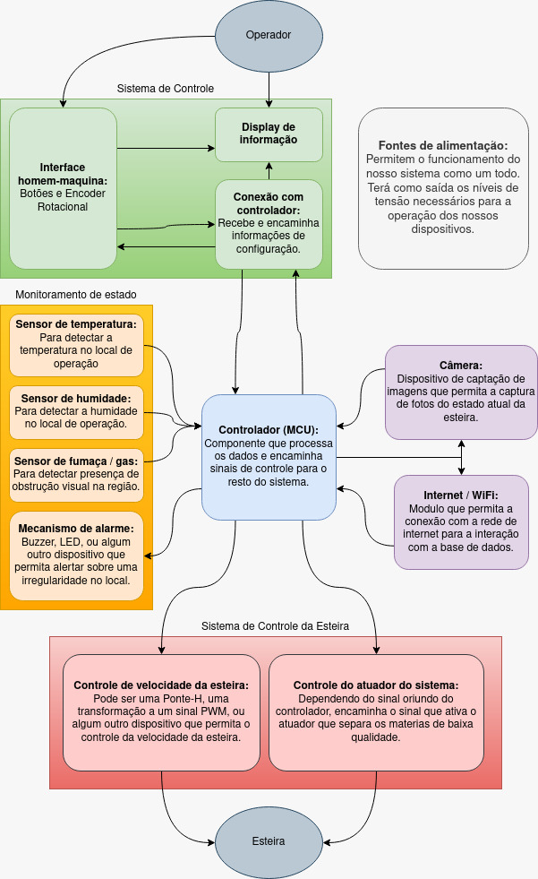

# `<OptiSort: Classificador de objetos>`
# `<OptiSort: Object classifier>`
## Apresentação

O presente projeto foi originado no contexto das atividades da disciplina de graduação *EA075 - Introdução ao Projeto de Sistemas Embarcados*, 
oferecida no primeiro semestre de 2024, na Unicamp, sob supervisão da Profa. Dra. Paula Dornhofer Paro Costa, do Departamento de Engenharia de Computação e Automação (DCA) da Faculdade de Engenharia Elétrica e de Computação (FEEC).
|Nome  | RA | Curso|
|--|--|--|
| Henrique Stumm Rocha  | 239694  | Eng. Elétrica|
| Melvin Gustavo Maradiaga Elvir  | 185068  | Eng. Elétrica|

## Descrição do Projeto
### Contexto Gerador e Motivação
Todo ano a ONU realiza um estudo, nomeado _Food Waste Index Report_, onde reportam a produção global de alimento e analizam o desperdiço alimentar gerado nos níveis de distribuição e consumidor final. Na versão mais recente [1] apresentaram-se os resultados oriundos de uma pesquisa realizada no Rio de Janeiro (pg.20-21) coletando dados de 102 lares distintos de díversos posicionamentos socio-econômicos. Nele, reportaram que um 39% do desperdiço era de alimentos ainda comestíveis, e estimaram uma produção anual de 77kg/capita de resíduo desta classe (classe II).  
Agora, olhando para a região de São Paulo, em 2022 foi publicado um artigo na revista Sustainability [2] fornecendo métricas de resíduo alimentar oriundo de feiras dentro da cidade, estimando uma produção de 27,9 kg de desperdiço por barraca. Estes dados, ao serem extrapolados ao periodo de um ano em todas as barracas da cidade, oferece uma primeira estimativa da geração de desperdiço na cidade, umas 59.300 toneladas ao ano, com uma parcela não desprezível sendo material ainda comestível.  
Com esses dados espera-se ter apontado que Brasil gera bastante desperdiço alimentar que, ainda com iniciativas auxiliando no seu aproveitamento (como o banco de alimentos dentro dos municípios), precisa ser contabilizado e administrado de formas mais eficientes para permitir o descarte (ou reuso) apropríado. Por conta disso, estamos propondo um projeto que consiga auxiliar na identificação, o registro e acompanhamento de desperdiço alimentar dentro dos principais centros de coleta de resíduo alimentar.

### Projeto
O OptiSort tem como objetivo realizar a classificação do desperdiço em centros de coleta alimentar (como bancos de alimentos) mediante a utilização de técnicas avançadas de visão computacional e aprendizado de máquina, sendo capaz de armazenar e disponibilizar os dados coletados ao longo da sua operação para o usuario.
Mediante sua implementação espera-se agilizar a classificação alimentar dentro dos locais onde ele for instalado, espera-se diminuir a perda de alimentos oriunda do erro humano dentro da classificação e espera-se apoiar o registro de desperdiço alimentar dentro da cidade.

> Atualmente não conseguimos levantar o valor econômico associado ao projeto por conta de ainda estar determinando a escala do protótipo que será desenvolvido e os materiais que serão utilizados para o seu desenvolvimento. Após termos feito isso, será possível realizar uma estimativa inicial.

## Descrição Funcional
### Funcionalidades
O OptiSort, como dito anteriormente, é um sistema de classificação automática para linhas de produção com foco na indústria alimentícia, mas tendo aplicações nas industrias farmacêuticas, automobilísticas e outras. Sua função principal é garantir a qualidade dos produtos através da identificação, classificação e remoção de itens que não atendam aos padrões de qualidade estabelecidos pelo usuario.

Ele realiza três grandes tarefas:
* **Identificação e classificação:** Reconhece diferentes tipos de itens e os separa em categorias, utilizando técnicas de visão computacional e aprendizado de máquina para identificar a qualidade associada a cada item.
* **Atuação na linha de produção:** Controle de atuadores para remover automaticamente os itens defeituosos da esteira principal, direcionando-os para uma linha secundária para reavaliação ou descarte.
* **Registro:** Monitora o funcionamento do sistema e armazena os dados de qualidade, quantidade e descarte numa base de dados. 

**Exemplo de aplicação:**  
Em uma linha de separação de frutas, o OptiSort:
* Detecta frutas estragadas por visão computacional.
* Empurra as frutas estragadas para fora da esteira principal.
* Direciona as frutas estragadas para uma linha secundária para reavaliação ou descarte.

### Configurabilidade
Para atingir a flexibilidade desejada deste sistema, o OptiSort conta com diversas configurações para atender às necessidades específicas de cada aplicação. Podemos agrupar as suas principais configurações em três grandes grupos:

#### Parâmetros de Identificação:
   - **Tipos de itens:** Definição dos tipos de itens que o sistema deve identificar e classificar. O usuário precisará capturar imagens de itens de diferentes níveis de qualidade para treinar o classificador com visão computacional. O processo de treinamento deve ser simples e intuitivo e não requerer o uso de programação.
   - **Probabilidade de rejeição:** A saída do classificador visual é um número correspondente à probabilidade de um item ser da categoria rejeitada. O limite de rejeição é a probabilidade a partir da qual o item deve ser identificado e retirado da linha de separação. Por exemplo, se o limite de rejeição for de 0.7, apenas produtos atribuídos com mais de 70% de probabilidade pelo sistema de visão computacional são removidos da esteira.
   - **Número máximo de itens rejeitados abandonados:** No caso de um item rejeitado não ser removido da esteira por fatores externos, o sistema registra esse evento. Se o número de itens rejeitados que passarem pela inspeção passar de uma determinada taxa, a esteira é interrompida

#### Parâmetros de Atuação
   - **Velocidade da esteira:** Ajuste da velocidade da esteira de acordo com o fluxo de produção.
   - **Velocidade do atuador:** Velocidade com que o atuador reage para retirar os itens defeituosos da linha principal.
   - **Ação do servomotor:** Distância em que o servomotor atua para remover os itens defeituosos da esteira. Pode ser regulada de acordo com os parâmetros da linha de separação.

#### Parâmetros de Registro
   - **Regularidade do Monitoramento:** Intervalo de tempo entre cada "monitoramento" do estado atual do dispositivo.

Os parâmetros mais físicos (como sendo os de atuação e alguns de registro) poderão ser configurados de forma dinâmica enquanto a linha de produção está em operação mediante um controlador.

**Exemplo de aplicação**
Em uma linha de separação de frutas, o sistema OptiSort pode ser configurado para:
* Identificar diferentes tipos de frutas (por exemplo, maçãs, laranjas, bananas).
* Classificar as frutas por qualidade, considerando estragadas aquelas cuja probabilidade for menor de 50%.
* Um segundo depois da fruta estragada ter sido identificada, remover ela da esteira mediante um servomotor.
* Gerar um relatório de produção detalhando o número de frutas processadas e separadas da linha principal.

### Eventos
Ao longo da sua operação definem-se vários tipos de "eventos" que descrevem o comportamento do sistema num determinado instante de tempo.

#### Eventos Periódicos
1. **Aquisição de Imagens:**  
    Periodicidade: _Contínua (cada X millisegundos)._  
    Descrição: _O sistema captura imagens da esteira transportadora prévio a realizar a identificação e classificação dos itens._

2. **Processamento de Imagens:**  
    Periodicidade: _Contínua (cada X millisegundos)._  
    Descrição: _O sistema aplica algoritmos de visão computacional e aprendizado de máquina para identificar os itens de interesse e realizar a análise da sua qualidade._

3. **Monitoramento do Sistema:**  
    Periodicidade: _Variável (pode ser configurado)._  
    Descrição: _O sistema monitora seu próprio desempenho, realiza tarefas dependendo do estado atual e encaminha a informação a uma base de dados._

#### Eventos Não Periódicos:
1. **Atuação na Linha de Produção:**  
    Descrição: _O sistema detecta um item de qualidade baixa na linha principal e ativa os atuadores._

2. **Passagem de item defeituoso para a próxima etapa:**  
    Descrição: _Devido a algum fator externo, como excesso de itens na esteira, o OptiSort não é capaz de remover o item defeituoso a tempo e ele passa para a próxima etapa de produção._

3. **Captação de dados do controlador:**  
   Descrição: _O sistema detecta que houve uma manipulação ao controlador de configuração._
   
4. **Registro de dados de operação:**  
   Descrição: _O sistema armazena os dados de operação da esteira numa base de dados._

5. **Atualizações de Software:**  
    Descrição: _O sistema pode receber atualizações de software para melhorar seu desempenho ou adicionar novas funcionalidades._

### Tratamento de Eventos
Abaixo, detalhamos mais sobre o comportamento do sistema para cada tipo de evento.

#### Eventos Periódicos:
1. **Aquisição de Imagens:** O sistema captura imagens da esteira transportadora mediante uma câmera ligada ao dispositivo controlador. As imagens são armazenadas em um buffer de memória para serem processadas posteriormente.  

2. **Processamento de Imagens:** O sistema aplica algoritmos de visão computacional e aprendizado de máquina para analisar as imagens e identificar os itens. As características dos itens (por exemplo, cor, tamanho, forma, textura) são extraídas e utilizadas para classificá-los. Mediante os pesos associados a cada item (determinados por prévio treinamento do algoritmo) o dispositivo determina a qualidade dos itens dentro da imagem.  

3. **Monitoramento do Sistema:** O sistema monitora alguns parâmetros, como temperatura, humidade, vibração e consumo de energia. Se um parâmetro estiver fora da faixa normal, o sistema gera um alarme para alertar o operador.  

#### Eventos Não Periódicos:
1. **Atuação na Linha de Produção:** Se um item defeituoso for detectado, o sistema aciona um servomotor para removê-lo da esteira. O item defeituoso é direcionado para uma linha secundária para reavaliação ou descarte.

2. **Passagem de item defeituoso para a próxima etapa:** A passagem acidental de um item defeituoso é registrada na memória do sistema. Se o número de itens defeituosos que passarem para a próxima etapa de produção for maior que o parâmetro especificado, o OptiSort interrompe a esteira e solicita avaliação do operador.

3.  **Captação de dados do controlador:** O usuario manipula o controlador vinculado ao dispositivo, gerando uma série de interrupções que permitem a manipulação da interface enquanto o controlador realiza suas tarefas principais. Após ter colocado e confirmado as alterações, o controlador controla a esteira com a nova informação armazenada dentro da sua memória.

4.  **Registro de dados de operação:** Depois de cada registro e classificação de item sendo realizado pela câmera e o controlador, ele vai encaminhando os dados registrados dentro da sua memória a uma base de dados que possa ser visualizada pelo operador.

5. **Atualizações de Software:** Reprogramação do controlador principal acrescentando ou modificando features dentro do funcionamento dele.

## Descrição Estrutural do Sistema

## Referências
[1] United Nations Environment Programme, Food Waste Index Report 2024. Think Eat Save: Tracking Progress to Halve Global Food Waste. [online]. Available: https://wedocs.unep.org/20.500.11822/45230. [Accessed: Mar. 31, 2024]. 

[2] Brancoli P, Makishi F, Lima PG, Rousta K. Compositional Analysis of Street Market Food Waste in Brazil. Sustainability. 2022; 14(12):7014. [online]. Available: https://doi.org/10.3390/su14127014 . [Accessed: Mar. 31, 2024].
