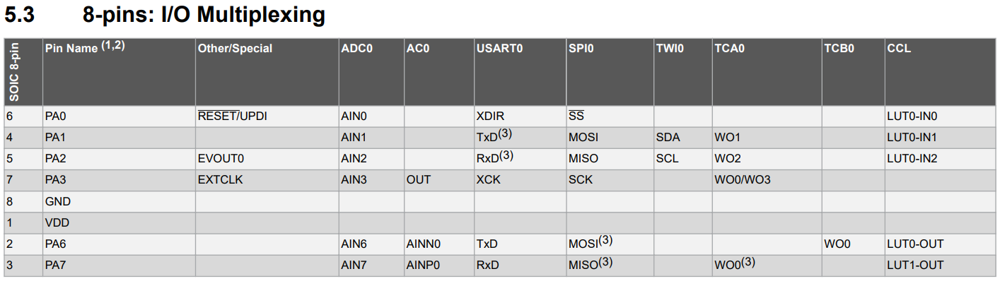

# `Rodovias Fluidas: Sistema de Redução de Congestionamentos`
# `Smooth Highways: Trafic Jam Reduction System`

## Apresentação

O presente projeto foi originado no contexto das atividades da disciplina de graduação *EA075 - Introdução ao Projeto de Sistemas Embarcados*, 
oferecida no primeiro semestre de 2024, na Unicamp, sob supervisão da Profa. Dra. Paula Dornhofer Paro Costa, do Departamento de Engenharia de Computação e Automação (DCA) da Faculdade de Engenharia Elétrica e de Computação (FEEC).

 |Nome  | RA | Curso|
 |--|--|--|
 | Kevin Caio Marques dos Santos  | 247218  | Eng. de Computação|
 | Thiago Maximo Pavão  | 247381  | Eng. de Computação|

## Arquivos Importantes

[Modelo 3D do projeto](images/3d_models.pdf)

[Esquemático em PDF](pdf/esquema_eletrico.pdf)

[Lista de Componentes](components.md)

[PCB](pdf/layout_pcb.pdf)

## Descrição do Projeto

O projeto foi idealizado para abordar um problema comum enfrentado pelos motoristas hoje em dia: congestionamentos em rodovias. Muitas vezes, atribui-se esse problema à ocorrência de acidentes que bloqueiam uma das vias, forçando o tráfego a se concentrar na outra via. No entanto, em muitos casos de congestionamento, não há acidente aparente ou outra explicação clara, o que levanta questões para os motoristas mais perspicazes.

Durante uma investigação sobre essa questão, foi encontrado um [vídeo](https://www.youtube.com/watch?v=iHzzSao6ypE) que explicava a causa de muitos congestionamentos. O principal fator identificado foi a grande disparidade de velocidades entre os veículos na mesma via, juntamente com ultrapassagens realizadas por veículos mais lentos. Isso faz com que outros motoristas tenham que reduzir sua velocidade, criando uma espécie de "onda de lentidão" que se propaga ao longo da rodovia. Eventualmente, essa onda de lentidão pode levar alguns carros a pararem completamente para evitar colisões.

Diante desse contexto, o objetivo do projeto é reduzir a propagação dessa onda de lentidão, diminuindo assim a extensão dos congestionamentos, especialmente nos pontos onde os motoristas são obrigados a parar completamente. O objetivo final é evitar que o congestionamento se agrave.

A prejudicialidade dos congestionamentos está muito além do atraso que gera para os motoristas em suas trajetórias diárias. Alguns exemplos de consequências são:

 - Estresse dos motoristas
 - Acidentes
 - Maior consumo de combustível
 - Maior poluição
 - Maior prejuízo para a saúde dos motoristas expostos a poluição gerada pelos carros

Nesse sentido, o Rodovias Fluídas® visa solucionar todos esses problemas ao monitorar o surgindo desses engarrafamentos e enviar informações aos motoristas que vem atrás para reduzirem a velocidade, de modo ao chegarem ao local do suposto congestionamento, ele ja tenha desaparecido. Com a implementação desse sistema, prevê-se que haja um significativo retorno econômico ao reduzir o consumo de combustível e a prevenção de acidentes.

## Descrição Funcional

O objetivo do projeto é identificar congestionamentos nas rodovias e avisar os motoristas que trafegam na mesma rodovia para reduzirem a velocidade, de modo que ao chegarem ao local em que existia o engarrafamento ele já tenha se resolvido.

### Funcionalidades

- Medir a velocidade do veículo
- Medir a posição do veículo na rodovia
- Mostrar mensagens em um display sobre congestionamentos e informar qual velocidade o motorista deve trafegar.
- Reproduzir avisos sonoros quando novas informações estão disponíveis
- Detectar a localização e o tamanho de congestionamentos
- Determinar a velocidade adequada em reação a um congestionamento à frente
- Capacidade de distribuição das informações sobre congestionamentos para os carros trafegando na rodovia 

### Configurabilidade

Como configuração, o usuário que possuir o dispositivo em seu carro pode optar por desabilitar o aviso sonoro e ao invés disso o display de informações deve piscar algumas vezes para chamar a atenção do motorista.

### Eventos

#### Módulo Móvel

1. Inicialização do sistema
2. Conexão do Módulo com uma torre dentro do seu alcance
3. Monitoramento da velocidade do veículo (periódico, 3 segundos)
4. Falha na comunicação com os periféricos
5. Recebimento de informações da torre
6. Perda de conexão com a torre

#### Módulo Fixo (Torre)

1. Inicialização do sistema
2. Nova conexão com um carro
3. Fim de uma conexão com um carro
4. Recebimento de dados (posição, direção e velocidade) de um carro
5. Notificação de condição de tráfego por outras torres
6. Atualização nas condições de tráfego da via (por algoritmo interno)

### Tratamento de Eventos

#### Módulo Móvel

1. Inicializa todos os periféricos e verifica por erros
2. Mostra a mensagem de conectado no visor lcd e inicializa um timer
3. Coleta a velocidade do veículo e compara com a última velocidade enviada a torre, se essa diferença for maior que um limite, envia as informações atuais de velocidade, direção e posição para a torre, e atualiza a última velocidade enviada para a atual
4. Para o timer, encerra a conexão com a torre se houver e mostra uma mensagem de erro no visor lcd se o erro não for no visor
5. Verifica a mensagem recebida, se for de congestionamento, mostra no visor a mensagem de cosgestionamento e a velocidade maxima fornecida pela torre, se não for de congestionamento apenas mostra a velocidade máxima recebida. Além disso, se a velocidade máxima recebida for diferente da última recebida, emite um alerta sonoro
6. Mostra a mensagem de disconectado no visor e para o timer 

#### Módulo Fixo (Torre)

1. Cria estruturas de dados para armazenamento das informações recebidas pelos carros e outras torres. Além disso, se conecta com as outras torres.
2. Informa a velocidade máxima da via, e cria entrada na tabela para armazenar dados enviados pelo carro.
3. Remove a entrada na tabela do carro desconectado.
4. Calcula a posição em que o carro se encontra na rodovia (o kilômetro) e atualiza os dados na tabela na posição relativa ao carro que gerou o evento.
5. Atualiza tabela de informações enviadas por outras torres. E propaga as informações recebidas para a torre vizinha.
6. Envia cada carro a velocidade que ele deve trafegar, avisando também se um congestionamento foi detectado. Além dos carros, avisa também torres vizinhas sobre as novas condições.

## Descrição Estrutural do Sistema

O sistema será composto por dois tipos de dispositivos: Módulos móveis, que estão presentes nos carros dos usuários do sistema e módulos fixos, presentes ao longo das rodovias, principalmente em trechos em que congestionamentos são comuns.

Os módulos móveis tem como objetivo monitorar a velocidade do carro e informar ao motorista quando deve reduzir sua velocidade. Ele baseia essa decisão em sinais recebidos pelo módulos fixo mais próximo. Além disso, tem o papel de informar a velocidade do carro para o módulo fixo mais próximo.

Os dispostivos fixos são torres colocadas ao longo da via, e tem como objetivo detectar congestionamentos, recebendo informações de velocidade dos motoristas mais próximos, e repassar a informação para torres anteriores na via, que por sua vez avisam sobre as condições ao módulos móveis proxímos a elas.


## Especificações

### Especificação Estrutural

A realização do projeto completo só é possível com a definição da forma de comunicação entre os dispositivos, as torres (módulo fixo) precisam ser capazes de realizar conexão com todos os carros em seu alcance e também com torres vizinhas. Para simplificar o projeto, nos limitamos a pesquisar algumas tecnlogias existentes ou em desenvolvimento que possam ser utilizadas para realizar essa comunicação, e portanto não especificamos aqui componentes nem os algoritmos necessários para tornar essa comunicação possível.

#### Módulo móvel

Tabela de periféricos escolhidos

| Nome | Interface | Links | Motivo | Custo |
|--|--|--|--|--|
| Display | I2C | [produto](https://www.baudaeletronica.com.br/produto/display-lcd-16x2-azul.html?utm_source=Site&utm_medium=GoogleMerchant&utm_campaign=GoogleMerchant) [datasheet](https://www.vishay.com/docs/37484/lcd016n002bcfhet.pdf) | Menor display que atende as mensagens que deseja-se mostrar e com menor custo, quando comparado a displays OLED, por exemplo. | R$ 18 |
| Buzzer ativo | GPIO | [produto](https://www.mercadolivre.com.br/3x-buzzer-ativo-5v-sinal-beep-arduino-raspberry-som/p/MLB32625316?matt_tool=18956390&utm_source=google_shopping&utm_medium=organic&item_id=MLB4440875150&from=gshop) | Apenas para realizar um aviso simples, buzzer ativo para não precisar gerar uma onda como entrada | R$ 3 |
| GPS | I2C | [produto](https://pt.aliexpress.com/item/1005001325488063.html?spm=a2g0o.productlist.main.21.16bf6D4k6D4kkE&algo_pvid=ee1dfcd7-d9ed-4cb6-a019-f2d89ec01ed2&algo_exp_id=ee1dfcd7-d9ed-4cb6-a019-f2d89ec01ed2-10&pdp_npi=4%40dis%21BRL%2118.12%2118.12%21%21%213.38%213.38%21%402103252b17163011627366297e1daf%2112000015698279168%21sea%21BR%210%21AB&curPageLogUid=ytOUFtU2BXcg&utparam-url=scene%3Asearch%7Cquery_from%3A) [datasheet](https://content.u-blox.com/sites/default/files/products/documents/NEO-6_DataSheet_%28GPS.G6-HW-09005%29.pdf) | Dispositivo simples de GPS e com precisão suficiente para o projeto, existem variações na família porém a de pior velocidade e resolução já excede o que é necessário para o projeto. | R$ 20 |
| Bússula de três eixos | I2C | [produto](https://pt.aliexpress.com/item/1005006291063452.html?spm=a2g0o.productlist.main.1.dc4evlYHvlYHY3&algo_pvid=c34535e0-7379-445e-bfe4-024fbe78167f&algo_exp_id=c34535e0-7379-445e-bfe4-024fbe78167f-0&pdp_npi=4%40dis%21BRL%2126.79%214.99%21%21%2136.19%216.74%21%402103248517163012654687965e29ec%2112000036755638743%21sea%21BR%210%21AB&curPageLogUid=qAsI2Sp9r1qq&utparam-url=scene%3Asearch%7Cquery_from%3A) [datasheet](https://pdf1.alldatasheet.com/datasheet-pdf/download/428790/HONEYWELL/HMC5883L.html) | Baixo custo e precisão suficiente para que a torre seja capaz de distinguir entre as duas direções da pista. | R$ 5 |
| ELM327 | USB | [produto](https://pt.aliexpress.com/item/1005004078281314.html) | Dispositivo mais comum para este tipo de interface com o carro pela porta ODB | R$ 20 |

Ainda é necessário definir um circuito integrado para realizar a conversão de USB para UART

Escolha da MCU:

Dos algoritmos especificados, vemos que este módulo exige baixa memória e pouca capacidade de processamento, porque a MCU é apenas responsável por intermediar os periféricos com as torres. Desta forma, encontramos a família de microcontroladoras de 8 bits ATtinyXXX.

link do datasheet: https://ww1.microchip.com/downloads/aemDocuments/documents/MCU08/ProductDocuments/DataSheets/ATtiny202-04-402-04-06-Auto-DataSheet-DS40002159A.pdf

Analisando entre as variações, a escolha deve ser feita com base no número de pinos e da quantidade de memória Flash/RAM. A versão com menos (8) pinos não disponibiliza nenhum pino multiplexável para I2C, e portanto não pode ser utilizada. Isto pode ser visto nas imagens abaixo, os pinos SDA e SCL são multiplexáveis apenas nos pinos PB0 e PB1, que não estão disponíveis nessa versão.

Pinagem das versões com 8 e 14 pinos


Tabela de multiplexação dos pinos



Já a versão de 14 pinos possibilita que sejam acessados os módulos USART, I2C e GPIO, que completa as interfaces necessárias. Quanto à memória, de acordo com nossas estimativas, a versão com 128 B de RAM e 2 kB de memória Flash deve ser suficiente. Portanto, definimos a microcontroladora ATtiny204, que tem um custo de apenas R$ 3. 

> Finalmente, deve-se especificar as restrições físicas e ambientais de funcionamento do circuito, tais como limites mecânicos
> (altura, largura, profundidade) e limites de dissipação térmica.

##### Características de Operação

| Componente | Intervalo de Tensão | Tensão recomendada |
|--|--|--|
| Display | -0.3~13V | 5V |
| Buzzer | 4~8V | 5V |
| GPS | 2.7~3.6V | 3V |
| Bussola | 3~5 | 5V |
| ATtiny204 | -0.5~6V | 3V |


#### Módulo fixo

Para simplificação do projeto, optou-se por focar na especificação do módulo móvel, e portanto não foram escolhidos precisamente os componentes e placa micro controladora para o módulo fixo. 

No entanto, foi percebido que a especificação dos algoritmos de tratamento de eventos neste módulo seria importante para um bom entendimento da dinâmica do projeto e do fluxo de informações, então eles foram feitos e podem ser vistos abaixo.

Além disso, algumas restrições de memória e de processamento foram comentadas, o que guiaria a escolha de componentes para este módulo: Processador, memória RAM, memória de programa e memória de dados.

### Especificação de Algoritmos 

Como já explicado, não realizamos a especificação do circuito utilizado para possibilitar a comunicação entre os módulos, mas supomos aqui que qualquer tecnologia utilizada seja capaz de gerar os seguintes eventos: conexão de um novo dispositivo, perca da conexão, recebimento de dados e envio de dados. Apenas supondo estes princípios de inter-comunicação foram gerados os algoritmos mostrados a seguir. 

#### Algoritmos do módulo móvel

```
// Evento 1: Ao inicializar
function setup() {
  status = initLCD();
  if(status == ERROR) {
    errorBeep();
    stop();
  }
  
  status = initGPS();
  if(status == ERROR) {
    showMessageLCD(INTERNAL_ERROR);
    errorBeep();
    stop();
  }

  status = initCompass();
  if(status == ERROR) {
    showMessageLCD(INTERNAL_ERROR);
    errorBeep();
    stop();
  }

  status = initCarCommunication();
  if(status == ERROR) {
    showMessageLCD(CAR_COMM_ERROR);
    errorBeep();
    stop();
  }
}

// Evento 2: Quando entra no alcance de uma torre, e se conecta a ela
function onConnect() {
  showMessageLCD(CONNECTED);
  startTimer();
}

// Evento 3: Quando o timer reinicia, curto período para detectar grandes variações na velocidade e notificar a torre
function timerInterrupt() {
  velocity = getCarVelocity();

  if(abs(velocity - lastSentVelocity) > TRESHOLD * velocity  or  currentTime - lastSentTime > MAX_PERIOD) {
    lastSentVelocity = velocity;
    gpsData = readGPS();
    compassData = readCompass();

    sendData(velocity, gpsData, compassData);
  }
}

// Evento 4: Ao ocorrer um erro de conexão com algum periferico, mostra mensagem de erro, se possível, e finaliza conexao com torre se necessário
function peripheralError(errorMessage){
  if(errorMessage != commTower){
     stopConnection();
  }
  if(errorMessage != commLCD) {
     showMessageLCD(DISCONNECTED);
  }
  errorBeep();
  stop();
}

// Evento 5: Ao receber um dado da torre. Informação sobre a velocidade máxima a se andar e se há congestionamento à frente
function receiveData(reponse) {
  if(response.trafficJam == True) {
    showMessageLCD(TRAFFIC_JAM, response.maxVelocity);
  }
  else {
    showMessageLCD(CONNECTED, response.maxVelocity);
  }

  if(lastMaxVelocity != response.maxVelocity) {
    alertBeep();
    lastMaxVelocity = response.maxVelocity;
  }
}

// Evento 6: Ao sair do alcance da torre
function onDisconnect() {
  showMessageLCD(DISCONNECTED);
  stopTimer();
}
```
Para este módulo não há grande necessidade de memória ram, será preciso armazenar temporariamente as informações de velocidade atual, velocidade enviada anteriormente, posição atual do veículo, direção de movimento, tempo de máquina atual e último tempo de máquina de envio. Além de pequenas informações informações de status e retornos de funções, porém tais variáveis serão apenas alguns bytes e por hora não serão contabilizadas, só serão levadas em consideração durante a estimativa final, a qual considerará uma quantidade a mais de armazenamento para englobar tais variáveis. Para as informações maiores, segue abaixo a análise de tamanho para cada variável:

- Velocidade atual: de 0 - 120 km/h com precisão de 5 km/h, temos 24 possibilidades, que necessita de 5 bits.
- Velocidade enviada anteriormente: de 0 - 120 km/h com precisão de 5 km/h, temos 24 possibilidades, que necessita de 5 bits.
- Posição: informações de latitudade e longitude recebidas pelo módulo de gps, ambas variáveis float, de 32 bits cada, 64 bits no total. 
- Direção: recebida pela bússola, informações de magnetude nos eixos x, y e z, a serem usadas para cálculos posteriores, todas essas informações possuem tamanho de 2 bytes cada, totalizando 48 bits.
- Tempo de máquina atual: fornecido pelo timer interno de execução do programa na MCU, variável de tipo int, 32 bits.
- Último tempo de máquina de envio: fornecido pelo timer interno de execução do programa na MCU, variável de tipo int, 32 bits. 

Realizando a soma de todos esses tamanhos, temos que o total de bits necessários para armazenar tais variáveis na memória ram é de: 5 + 5 + 64 + 48 + 32 + 32 = 186 bits ~ 25 bytes
O valor de bytes foi arredondado para cima, de modo a englobar aquelas outras variáveis comentadas anteriormente.

Além disso, será necessário armazenar as mensagens que serão mostradas no display lcd, tais mensagens serão armazenadas em uma memória flash, pois toda vez que ligar o sistema as mensagens que podem ser exibidas serão as mesmas, portanto necessitam ser armazenada em uma memória não volátil. Segue abaixo as frases e os cálculos de tamnanhos de armazenamento:

Mensagens mostradas em operação normal:

Primeira Linha do display:
  - "Conectado": temos 9 caracteres, mais 1 caractere do '\0' no final da string, cada caractere de 1 byte, totalizando 10 bytes.  
  - "Desconectado": temos 12 caracteres, mais 1 caractere do '\0' no final da string, cada caractere de 1 byte, totalizando 13 bytes.   
  - "Congestionamento": temos 16 caracteres, mais 1 caractere do '\0' no final da string, cada caractere de 1 byte, totalizando 17 bytes.
    
Segunda Linha do display:	
  - "Vmax: xxx km/h": temos 14 caracteres, mais 1 caractere do '\0' no final da string, cada caractere de 1 byte, totalizando 15 bytes.
    
Mensagens mostradas em eventos de erros:

Primeira Linha do display:
  - "Erro": temos 4 caracteres, mais 1 caractere do '\0' no final da string, cada caractere de 1 byte, totalizando 5 bytes.  
  - "Erro Interno": temos 12 caracteres, mais 1 caractere do '\0' no final da string, cada caractere de 1 byte, totalizando 13 bytes.
    
Segunda Linha do display:
  - "conexão carro": temos 13 caracteres, cada caractere de 1 byte, totalizando 14 bytes.  
  - "tente reiniciar": temos 15 caracteres, cada caractere de 1 byte, totalizando 16 bytes.  

Somando todos esses valores, temos que o total de bytes necessários para armazenar essas mensagens é de 103 bytes. 
Para o cálculo do tamanho da memória flash, temos que ela precisa ser de no mínimo 103 bytes, para armazenar pelo menos todas as mensagens a serem exibidas. Para armazenar todo o programa estima-se que necessitará na ordem de centenas de bytes. 

#### Algoritmos do módulo fixo

```
// Evento 1: Ao inicializar
function setup() {
  initCarsInfoTable();
  initTowersInfoTable();

  connectNeighboringTowers();
}

// Evento 2: Carro se conecta à torre ao entrar em seu alcance
function onCarConnect(car) {
  addEntryOnCarTable(car);
  car.sendData(ROAD_MAX_VELOCITY);
}

// Evento 3: Recebimento de dados (posição, direção e velocidade) de um carro
function receiveCarData(data) {
  roadPosition = calculateCarPositionOnRoad(data.position);
  updateEntryOnCarTable(roadPosition, data.direction, data.speed);
}

// Evento 4: Carro se desconecta da torre (fora do range)
function onCarDisconnect(car) {
  removeEntryFromCarTable(car);
}

// Evento 5: Ao receber mensagens de outras torres com atualizações
function onTrafficConditionNotification(trafficCondition) {
  updateTowerTable(trafficCondition);
  propagateNotification();
}

// Evento 6: Ao detectar internamente uma atualização nas condições de tráfego
function onTrafficConditionUpdate(trafficCondition) {
  for(car in table) {
    maxVelocity = calculateMaxVelocity(car.position, car.direction, trafficCondition);
    car.sendData(TRAFFIC_JAM, maxVelocity);
  }

  notifyNeighboringTowers(trafficCondition);
}
```

A lógica mais complexa do programa está na função de análise dos dados coletados dos carros e informações recebidas das outras torres, a ideia é que essa análise seja feita continuamente em segundo plano por algum algoritmo potencialmente sofisticado. Uma possibilidade é que isso fosse feito por algum algoritmo de inteligência artificial, mas isso traz a necessidade de um processador mais poderoso. Também poderia ser interessante utilizar um processador com mais de um núcleo, para que as tarefas de comunicação com os veículos e com as outras torres (e outras tarefas acopladas à estas) possam ser feitas de forma independente da análise dos dados em tempo real, sem interromper o algoritmo de análise.

Uma análise de memória que pode ser feita a partir dos algoritmos mostrados é a seguinte. Temos duas tabelas de dados que devem ser armazenadas na memória RAM, o tamanho máximo de cada uma delas depende da quantidade de carros suportada por cada torre e da quantidade de informações relativas à outras torres que cada uma armazenará.

Supondo que 

- Cada torre tenha um alcance de 1 km
- Para o algoritmo de prevenção de congestionamento seja necessário ter as informações de tráfego de 21 km à frente
- Cada torre suporte atender 250 carros

A tabela de informações das torres terá portanto conhecimento de um total de 21 km * 2 = 42 km (bidirecional) e então cada torre precisa se comunicar e armazenar informações de outras 20.
Supondo que o pacote de informações de cada uma seja de 10 bytes, detalhando bem o estado do tráfego precisariamos de 20 * 10 = 200 bytes de memória RAM para essa tabela.

Sobre cada carro conectado, a torre deve armazenar informações sobre sua posição, velocidade e direção e portanto a quantidade de bits para cada carro é dada por

- Posição: especificar em um espaço de 2 km, com precisão de 100m, temos 20 possibilidades, necessitando de 5 bits.
- Velocidade: de 0 - 120 km/h com precisão de 5 km/h, temos 24 possibilidades, que necessita de 5 bits.
- Direção: O carro pode estar andando apenas em um dos dois sentidos na via, portanto é apenas necessário um bit.

Isso totaliza 11 bits por carro, e portanto 2750 bits ~ 344 bytes.

Além disso, cada torre precisa armazenar um mapa para conseguir associar a posição dada pelo GPS de cada módulo móvel à uma posição na pista (o kilômetro da posição, por exemplo).

O mapa das torres pode ser representado como uma lista de coordenadas e o kilômetro equivalente para a coordenada em questão. Considerando 4 bytes para longitude e latitude, mais 5 bits para especificação da posição relativa ao alcance da torre. Temos então 69 bits por linha, o que totaliza aproximadamente 173 bytes.

Sobre memória de programa, temos algo muito maior do que o caso do módulo móvel. O algoritmo de análise de dados e a função de determinação da posição do carro na rodovia são provavelmente os maiores ocupantes deste tipo de memória, por serem lógicas mais complexas. Estima-se que seja necessário uma memória de programa na ordem de kilo bytes ou dezenas de kilo bytes.

Um resumo dos requisitos de memória do sistema são então

- Memória RAM: 600 B
- Memória de dados (mapa, ROM): 200 B
- Memória de programa (ROM ou Flash): ~ 10 kB

## Referências

- Vídeo motivador do projeto: https://www.youtube.com/watch?v=iHzzSao6ypE
