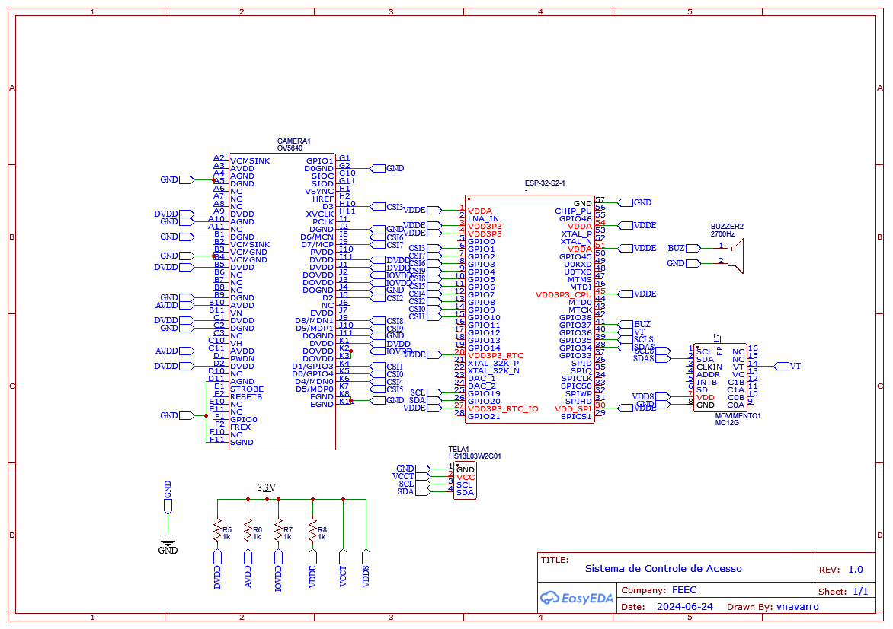
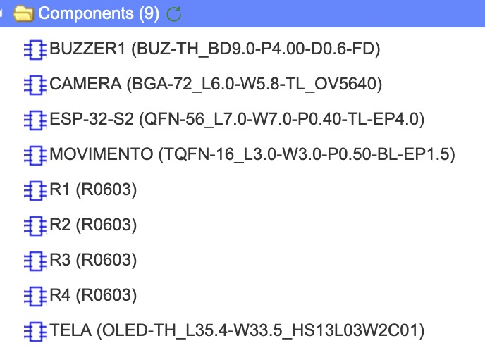
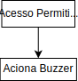

# `Sistema de Controle e Gerenciamento de Acesso`
# `Access Control and Management System`

## Apresentação

O presente projeto foi originado no contexto das atividades da disciplina de graduação *EA075 - Introdução ao Projeto de Sistemas Embarcados*, 
oferecida no primeiro semestre de 2024, na Unicamp, sob supervisão da Profa. Dra. Paula Dornhofer Paro Costa, do Departamento de Engenharia de Computação e Automação (DCA) da Faculdade de Engenharia Elétrica e de Computação (FEEC).

> |Nome  | RA | Curso|
> |--|--|--|
> | Thiago Masanori Hata | 194345  | Eng. Elétrica|
> | Victoria Helena Alves Navarro  | 236015  | Eng. Elétrica|

## Arquivos Importantes
https://github.com/thiagomasanori/ea075-2024.1/blob/8f103071f3dedd26249b199364f347b71992c265/projetos/sistema-controle-de-acesso/images/Schematic_controle_acesso.pdf (link para imagens/pdf esquemático)
(

(

(

## Descrição do Projeto

> Descrição do objetivo principal do projeto, incluindo contexto gerador, motivação.
> > Um sistema de controle de acesso físico tem a função de gerenciar o acesso de pessoas em uma determinada área garantindo a segurança e a gestão eficiente de acesso, utilizando uma combinação de hardware e software especializados. Com o avanço das tecnologias de autenticação digital, os sistemas de controle de acesso físico ganham muita flexibilidade para implementar métodos mais seguros e práticos para garantir a segurança de usuários. Os métodos mais implementados atualmente incluem a sensores biométricos, senhas ou cartões de identificação RFID(sigla para “Radio Frequency Identification”, significa “identificação por radiofrequência”).
> >

> Escreva essa seção imaginando que está tentando convencer alguém a investir financeiramente no seu projeto.
> > A implementação de um sistema de controle de acesso físico melhora a segurança e eficiência de entrada em edifícios comerciais, residenciais, hospitalares e instituições educacionais.
> > A demanda por controle de acesso seguro está em ascensão, e empresas e organizações buscam soluções confiáveis para garantir quem entra e sai de suas instalações. Nosso sistema oferece uma experiência de acesso mais rápida e conveniente, permitindo que os usuários utilizem biometria facial e QR Code, eliminando a necessidade de chaves físicas. Além disso, a automação do controle de acesso reduz os custos relacionados a gestão de chaves, perdas de chaves e substituição de fechaduras. O mercado de controle de acessos está projetado para crescer significativamente nos próximos anos, tornando esse investimento uma oportunidade com grande potencial.

> > 
> Qual problema vocês pretendem solucionar?
> > Com a nossa ferramenta de controle de acessos pretendemos solucionar problemas relacionados a:
> > - Segurança: a biometria facial é extramamente difícil de ser enganada e o QR code mutável a cada 5 segundos permite um aumento significativo da segurança de acesso
> > - Conveniência: o uso de biometria facial e QR code não exige que o usuário carregue algo além de seu celular para realizar a entrada de forma prática e segura
> > 
> Quem são os potenciais usuários?
> > Empresas, pessoas físicas, comércios e hospitais

> É possível estabelecer um valor econômico associado?
> > Sim, esses sistemas já existentes no mercado são vendidos entre R$2.500,00 e R$4.000,00 a unidade com catraca.

## Descrição Funcional
> A descrição funcional do projeto é a principal entrega do E1 e pode ser realizada neste próprio arquivo Markdown,
> com links para diagramas ou outros arquivos que estejam no próprio repositório.
>  
> 

### Funcionalidades
> Tarefas que o sistema será capaz de executar:
> - O sistema deve ser capaz de se comunicar remotamente (bluetooth, wifi,...)
> - Deve ter acesso à internet
> - Deve ser capaz de captar e transmitir imagens de vídeo (câmera)
> - Deve ser capaz de controlar uma fechadura elétrica ou portão
> - Deve ser capaz de emitir algum sinal que indique que o acesso foi autorizado com sucesso
> - Base de dados (pessoas autorizadas e histórico de acessos)
> > 

### Configurabilidade
> Detalhe, se houver, todas as possíveis configurações do circuito e todos os pontos de alteração da configuração.
>
> A empresa poderá escolher se os usuários utilizarão identificação por biometria facial ou QR via aplicativo.
> - Biometria facial: será necessário que o usuário final envie para a empresa uma foto recente com fundo branco, boa iluminação e sem acessórios como óculos e chapeu. A imagem será armazenada no banco de dados e será utilizar como meio de comparação a cada tentativa de acesso
> - QR Code: o usuário final deverá baixar um aplicativo que será conectado com os dados relacionados a empresa. Após as configurações iniciais, a cada tentativa de login o usuário deverá abrir o aplicativo e apontar o QR Code para a câmera na entrada onde será comparado. O QR code será gerado automaticamente a cada 5 segundos.
>   
### Eventos
> Quais eventos o sistema deve tratar?
> Se aplicável, classifique os eventos que são periódicos (procure especificar a periodicidade) e os que são não-periódicos
> (qual o tempo mínimo entre dois eventos sucessivos)?
> > O sistema deve ser capaz de permanecer em estado de stand by, pois assim que um movimento for dectado ele deve ser capaz de ler o que for apontado para a sua câmera. Sendo um rosto ou um QR code, o sistema deve capturar a imagem e comparar com o banco de dados em um tempo ágil, não mais do que 30 segundos.

### Tratamento de Eventos
> Qual comportamento o sistema deve ter para tratar corretamente cada evento?
>
> O sistema terá comportamentos diferentes para o caso da identificação ou não da imagem recebida frente a base de dados
> - Acesso permitido: se os dados apresentados pelas formas de identificação forem iguais as cópias de segurança, o acesso será liberado e a mensagem "Acesso Permitido" aparecerá na tela.
> - Acesso negado: se os dados apresentados pelas formas de identificação forem diferentes das cópias de segurança, o acesso será negado e a mensagem "Acesso Negado. Favor procurar a administração" aparecerá na tela.

## Descrição Estrutural do Sistema
> Junto com a descrição do comportamento do sistema, deve-se especificar, em nível de bloco ou sistema, a estrutura necessária 
> para captar os eventos do mundo externo, para alojar e processar o programa de tratamento de eventos, e para atuar sobre o mundo externo.
>
> Para essa descrição recomenda-se a criação de diagramas de blocos.
> Nesse diagrama, devem ser destacados os blocos funcionais que compõem o sistema, incluindo uma síntese das funcionalidades de cada bloco.
> Além disso, deve-se esclarecer também o relacionamento entre estes blocos, incluindo os principais sinais de comunicação entre
> os blocos de forma a assegurar a execução de todas as tarefas que o sistema deve realizar.

> 
>
> 1. O módulo de entrada com reconhecimento facial ou QR Code é responsável por capturar as imagens e processá-las para identificação
> 2. O banco de dados armazena as informações sobre os usuários com ID, foto e permissões de entrada. Utilizado para relacionar os resultados o módulo de entrada com cada usuário
> 3. O controlador de acesso recebe os dados dos módulos 1 e 2 e toma as decisões de liberar ou não o acesso
> 4. A catraca/porta são os pontos físicos controlados pelo módulo 3
> 5. A interface com o usuário é um aplicativo móvel ou painel de controle no qual ele pode sozinho ou com auxilio de um administrador inserir as suas informações e solicitar acessos.
> 
Você sabia? Ferramentas como o `draw.io` permitem integração com o Github.

## Especificações
### Especificações Estruturais
> 1. Objetivo do Projeto
>    Desenvolver um sistema de controle e gerenciamento de acesso utilizando ESP32-CAM para identificação de usuários via imagem ou leitura de QR Code. O administrador terá a opção de escolher o método de identificação
> 
> 2. Componentes Principais
>    - ESP32-S2: Módulo principal para captura de imagens e processamento.
     - Câmera OV5640: Integrada ao ESP32-S2 para captura de imagens.
     - Leitor de QR Code: Pode ser implementado via software utilizando a câmera OV5640 no ESP32-S2.
     - Microcontrolador ESP32-S2: Para controle do sistema, processamento de imagens e leitura de QR Codes.
>    - Sensor de presença: detectar a presença do usuário para acionar a câmera

> 3. Definição dos Periféricos
>    - Câmera OV5640: Entrada para captura de imagens.
     - Display LCD/OLED (HS13L03W2C01): Saída para que o usuário veja a imagem que ele está gerando na câmera, podendo posicionar o QR no local indicado para melhor leitura pela câmera.
     - Buzzer(QMB-09B-03): Indicação sonora de sucesso ou falha na identificação.
>    - Sensor de presença(MC12G): detectar a presença do usuário para acionar a câmera.

> 4. Endereçamento
>    - Câmera: Integrada no ESP32-S2, acessada via GPIOs específicos do módulo
>    - Banco de dados via WI-FI
>    - Sensor de presença via SPI
>    - Display via I2C
>      
> 5. Unidade Microcontroladora
>    - Microcontrolador ESP32-S2: Central do sistema, responsável pelo controle, captura de imagens, processamento e leitura de QR Codes. Não é necessário decodificador de endereços, pois a unidade microcontroladora possui GPIOs e interfaces de comunicação suficientes para conectar diretamente aos periféricos
>      
> 6. Circuitos de Interface
>    - Conversores AD/DA: Não necessários, pois os sensores e atuadores são digitais.
>    - Circuitos de Sincronização de Sinais Temporais: Não necessários para este projeto
>    - Padrões de Comunicação: I2C/SPI
>      
> 7. Restrições Físicas e Ambientais
>    - Dissipação Térmica: Monitorar a temperatura do módulo, garantindo ventilação adequada para evitar superaquecimento.
>      
> 8. Implementação do Sistema
>    - Configuração Inicial:
>     1. Configurar o ESP32-S2 para capturar imagens e processá-las utilizando bibliotecas de reconhecimento facial ou de QR Code.
>     2. Implementar um sistema de seleção de modo de operação (imagem ou QR Code) via interface web.
>    - Identificação por Imagem:
>     1. Captura de Imagem: Utilizar a câmera OV5640 para capturar a imagem do usuário.
>     2. Processamento: Implementar algoritmo de reconhecimento facial (utilizando bibliotecas como ESP-WHO da Espressif).
>     3. Decisão: Verificar se o rosto identificado está na base de dados de usuários autorizados.
>    - Identificação por QR Code:
>     1. Leitura de QR Code: Capturar imagem e processar para leitura do QR Code utilizando bibliotecas como ZXing.
>     2. Processamento: Decodificar o QR Code para obter informações do usuário.
>     3. Decisão: Verificar se a informação obtida está na base de dados de usuários autorizados.
>    - Interação com o Usuário
>     1. Feedback Sonoro: Utilizar buzzers para indicar sucesso ou falha na identificação.
>     2. Display: Mostrar feedback da imagem que o usuário está gerando na câmera e apontar o local correto para enquadramento do QR code.

### Especificação de Algoritmos
> Dado o diagrama de blocos do sistema apresentado abaixo, para cada evento do sistema temos
> 
> 
> Evento: Inicialização do Sistema
>> 

> Evento: Captura de Imagem
>> 

> Evento: Processamento de Imagem
>> 
>> 
> Evento: Leitura de QR Code
>> 
>> 
> Evento: Processamento de QR Code
>> 
>> 
> Evento: Feedback Sonoro
>> 

> A estimativa da memória necessária é baseada nas informações encontradas nos datasheets dos componentes e outras encontradas na internet. Com isso, temos que
>> Código do Programa:
>>>          Inicialização do sistema: 15 KB
>>>          Captura e processamento de imagem: 70 KB
>>>          Captura e leitura de QR Code:  50 KB
>>>          Interação com o usuário (buzzer): 5 KB
>> Bibliotecas:
>>>          Reconhecimento facial (ESP-WHO): 150 KB
>>>          Leitura de QR Code (ZXing): 100 KB
>>>          Periféricos (display, buzzer): 20 KB
>> Dados:
>>>          Base de dados de usuários: 100 KB
>>>          Dados temporários (buffers): 100 KB
>> Sistema Operacional e Overhead:
>>>          Overhead: 50 KB
>> Total:
>>>          Código do Programa: 140 KB
>>>          Bibliotecas: 270 KB
>>>          Dados: 200 KB
>>>          Sistema Operacional e Overhead: 50 KB
>> Logo: 660KB

## Referências
> Seção obrigatória. Inclua aqui referências utilizadas no projeto.
> 1) Controle de acesso à rede: saiba tudo sobre essas soluções ... - Varonis. https://www.varonis.com/pt-br/blog/controle-de-acesso-a-rede-saiba-tudo-sobre-essas-solucoes-e-sua-importancia.
> 2) Kit RFID com Arduino: Sistema de Controle de Acesso. https://blog.eletrogate.com/kit-rfid-com-arduino-sistema-de-controle-de-acesso/.
> 3) Controle de Acesso com RFID e Arduino - Lobo da Robótica. https://lobodarobotica.com/blog/controle-de-acesso-arduino-rfid/.
> 4) 5 sistemas grátis e open source de monitoramento de rede. https://www.capterra.com.br/blog/1583/monitoramento-de-rede.
> 5) 5 programas de acesso remoto para controlar o seu PC a distância. https://www.techtudo.com.br/listas/2023/07/quer-controlar-seu-pc-a-distancia-veja-5-programas-de-acesso-remoto-edsoftwares.ghtml.
> 6) Acesso remoto: veja o que é e como fazer em outro PC ou celular via app. https://www.techtudo.com.br/noticias/2023/02/o-que-e-acesso-remoto-entenda-tudo-sobre-conexao-distancia-edsoftwares.ghtml.
> 7) Sistema de Controle e Gerenciamento de Acesso. https://riu.ufam.edu.br/bitstream/prefix/6638/11/TCC_DavidFigueira.pdf.
> 8) ESP32 com Câmera e Reconhecimento Facial. YouTube, 13 mar. 2023. Disponível em: https://www.youtube.com/watch?v=915jxGwLxxI. Acesso em: 19 maio 2024.
> 9) ESP32 e RFID - Liberando acessos e Travas #MaratonaMaker. YouTube, 23 maio 2024. Disponível em: https://youtu.be/L4vh95aklPc?feature=shared. Acesso em: 19 maio 2024.
> 10) LCSC. Datasheet HS-HS13L03W2C01. Disponível em: https://www.lcsc.com/datasheet/lcsc_datasheet_2307201018_HS-HS13L03W2C01_C7465997.pdf. Acesso em: 15 jun. 2024.
> 11) HardwareHarry. Mysentech MC12G EN translation, 22 June 2024. Disponível em: https://github.com/HardwareHarry/MC12G-Documentation/blob/main/Mysentech-MC12G_EN_translation_22_June_2024.pdf. Acesso em: 15 jun. 2024.
> 12) SparkFun. OV5640 Datasheet. Disponível em: https://cdn.sparkfun.com/datasheets/Sensors/LightImaging/OV5640_datasheet.pdf. Acesso em: 15 jun. 2024.
> 13) Espressif Systems. ESP32-S2 Datasheet EN. Disponível em: https://www.espressif.com/sites/default/files/documentation/esp32-s2_datasheet_en.pdf. Acesso em: 15 jun. 2024.
